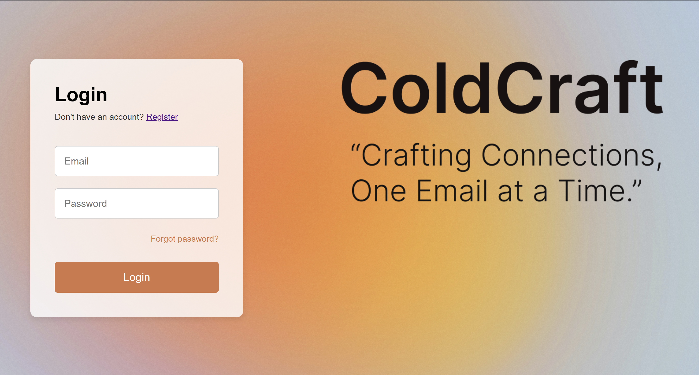

# ColdConnect: AI Cold Email Generator and Sender


An intelligent AI-powered platform that automates the creation and delivery of personalized cold emails for recruitment and sales outreach. ColdConnect leverages advanced web scraping, natural language processing, and automated email delivery to streamline your outreach campaigns.

## 🎥 Demo Video

Click the link above to view the full demonstration of ColdConnect in action

[](media/trial.mp4)

## 🚀 Features

### 🤖 AI-Powered Email Generation
- **Intelligent Web Scraping**: Utilizes Crawl4AI to harvest and preprocess web data from job postings
- **Smart Content Extraction**: Transforms raw HTML into structured JSON data for downstream processing
- **Personalized Email Creation**: Leverages Groq API with Llama 3.1 70B to generate high-impact, tailored cold emails
- **75% Time Reduction**: Automates content creation, dramatically reducing manual drafting time

### 📧 Automated Email Delivery
- **SMTP Integration**: Seamless integration with Google's 2FA SMTP service for reliable email delivery
- **Direct HR Outreach**: Automated dispatch of personalized messages directly to HR contacts
- **Scalable Campaigns**: Enables large-scale recruitment and sales outreach campaigns

### 🔧 User-Friendly Workflow
- **Secure Configuration**: Users provide their GROQ API key, 2FA email credentials, LinkedIn URL, and resume
- **Simple Job Input**: Just paste a job posting URL to initiate the AI-driven process
- **Editable Output**: Review and customize generated emails before sending
- **One-Click Delivery**: Send emails directly to HR with a single click

## 🛠️ Technology Stack

- **Backend**: Django (Python)
- **Frontend**: HTML5, CSS3, JavaScript
- **AI/ML**: Langchain, GROQ API (Llama 3.1 70B)
- **Database**: Firebase
- **Web Scraping**: Crawl4AI
- **Email Service**: Google 2FA SMTP
- **Authentication**: Google OAuth 2.0

## 🏗️ Architecture

### Data Flow Pipeline
1. **Data Collection**: Crawl4AI scrapes job posting URLs and extracts relevant information
2. **Data Processing**: Raw HTML is converted to structured JSON format
3. **Information Extraction**: Langchain chains with custom prompt templates extract key job details
4. **Email Generation**: Second Langchain chain generates personalized cold emails using:
   - Extracted job information
   - User profile data (LinkedIn, resume)
   - Custom prompt templates
5. **Email Delivery**: SMTP integration sends final emails to specified HR contacts


### Initial Setup
1. **Create Account**: Sign up and complete your profile
2. **Add Credentials**: 
   - GROQ API Cloud key
   - 2FA email password
   - LinkedIn URL
   - Resume Google Drive link

### Generating Cold Emails
1. **Input Job URL**: Paste the job posting URL you want to apply for
2. **AI Processing**: The system will:
   - Scrape job details using Crawl4AI
   - Extract key information via Langchain
   - Generate personalized email content
3. **Review & Edit**: Customize the generated email as needed
4. **Send Email**: Enter HR email address and send directly


### Key Components
- **Web Scraper Module**: Crawl4AI-powered data extraction
- **AI Processing Engine**: Groq API integration for content generation
- **Email Composer**: Langchain-based email creation pipeline
- **SMTP Handler**: Automated email delivery system
- **User Management**: Firebase-based profile and credential storage

## 🚦 Getting Started

### Prerequisites
- Python 3.8+
- Django 4.0+
- GROQ API key
- Google 2FA-enabled email account
- Firebase project setup

### Installation

1. **Clone the repository**
```bash
git clone https://github.com/yourusername/coldconnect.git
cd coldconnect
```

2. **Create virtual environment**
```bash
python -m venv venv
source venv/bin/activate  # On Windows: venv\Scripts\activate
```

3. **Install dependencies**
```bash
pip install -r requirements.txt
```

4. **Run migrations**
```bash
python manage.py makemigrations
python manage.py migrate
```

5. **Start the development server**
```bash
python manage.py runserver
```

## 🙏 Acknowledgments

- **Crawl4AI** for powerful web scraping capabilities
- **Groq** for high-performance AI inference
- **Langchain** for AI application development framework
- **Google** for robust SMTP services

---

**Made with ❤️ for efficient professional outreach**


